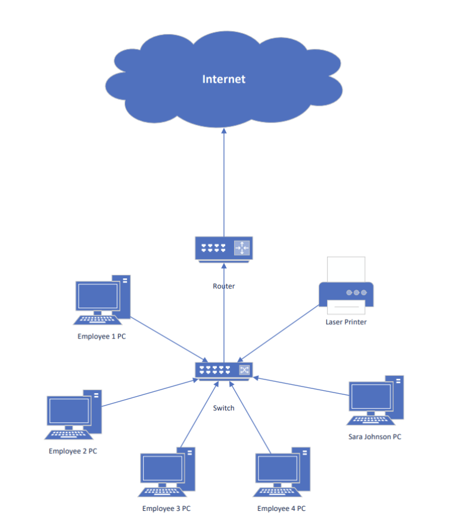
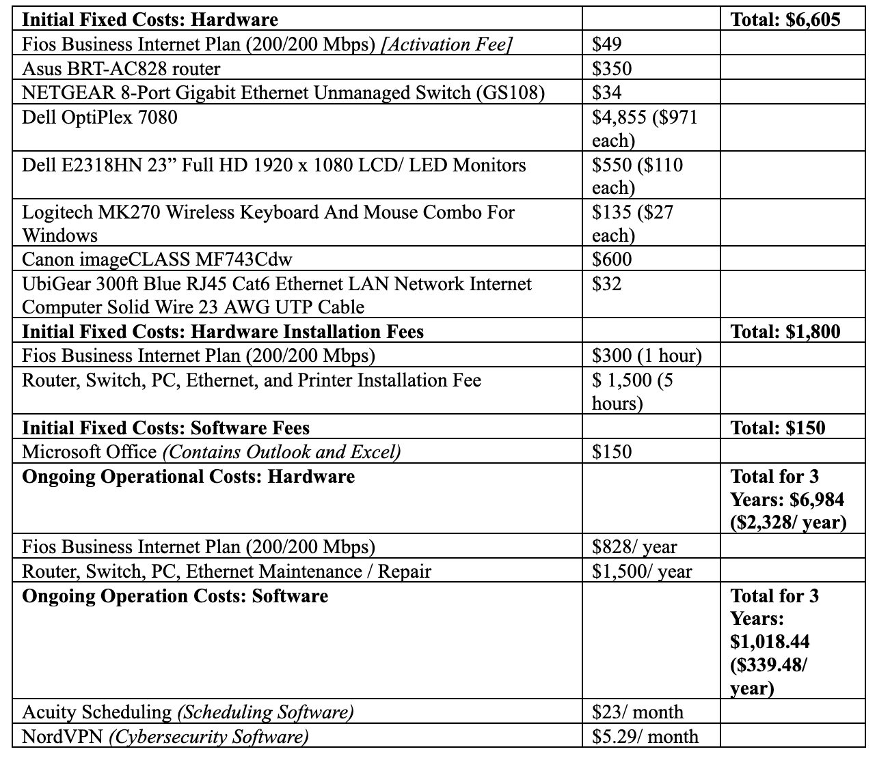

# Small Business Network Design Proposal (Wired Ethernet)

## Overview
This repository contains a complete **network infrastructure design proposal** for a small business relocating to a new office. The project focuses on creating a **secure, reliable, and scalable wired network** using switch-based Ethernet and a star topology.

The proposal includes business requirements analysis, logical network design, hardware and software selection, cybersecurity considerations, and a full cost assessment.

---

## Project Objectives
- Design a wired Ethernet network suitable for multiple simultaneous users  
- Ensure fast speeds, reliability, and ease of management  
- Minimize cybersecurity risks through proper hardware and software choices  
- Provide a cost-effective solution with clear short-term and long-term costs  

---

## Network Design Summary
- **Network Type:** Switch-based Ethernet  
- **Topology:** Star topology  
- **Connectivity:** Wired LAN with WAN internet access  
- **Users Supported:** 5 employee workstations and 1 networked printer  
- **Internet Provider:** Business-grade broadband  

---

## Logical Network Design
The logical design uses a **star topology**, with all devices connected to a central switch. The switch connects to a router, which then connects to the Internet via the ISP. This design improves performance, simplifies troubleshooting, and allows devices to communicate simultaneously.

### Logical Network Diagram

---

## Hardware & Technology Stack
**Networking Equipment**
- Business-grade router  
- Gigabit Ethernet switch  
- Cat6 Ethernet cabling  

**End Devices**
- Desktop PCs for employees  
- Networked laser printer  

**Software**
- Windows OS  
- Microsoft Office (Outlook, Excel)  
- Scheduling software  
- VPN and security software  

---

## Cost Assessment
The project includes both **initial fixed costs** and **ongoing operational costs** over a three-year period. Costs account for hardware, installation, software licensing, internet service, and maintenance.

### Cost Breakdown Visualization

---

## Documentation
- **Full Proposal (PDF):**  
  `business-network-proposal.pdf`  
  Includes detailed explanations, citations, and justification for all design decisions.

---

## Skills Demonstrated
- Network planning and design  
- Business requirements analysis  
- IT infrastructure documentation  
- Cybersecurity considerations  
- Cost and feasibility analysis  
- Technical and professional writing  

---

## What I Learned

This project helped me better understand how technical decisions should always start from **business needs**. Before choosing any hardware or software, I focused on understanding the company’s goals, constraints, and daily operations, which made the final network design more realistic and cost-effective.

I also learned how infrastructure choices affect **day-to-day business operations**. Network topology, equipment reliability, and security tools all impact employee productivity, system uptime, and long-term maintenance costs. Designing a star topology with switch-based Ethernet simplified management and reduced future risk.

Another important lesson was understanding the **total cost of ownership**, not just upfront expenses. Factoring in installation, maintenance, internet service, and recurring software costs made it clear how technology decisions directly influence budgeting and long-term planning.

Overall, this project strengthened my ability to approach technical problems from a **business analyst perspective**, connecting operational requirements, technical solutions, and financial considerations into a clear, well-documented proposal.

---
## Notes
This project was created as an academic and portfolio piece to demonstrate real-world small business network design using industry-standard practices.
